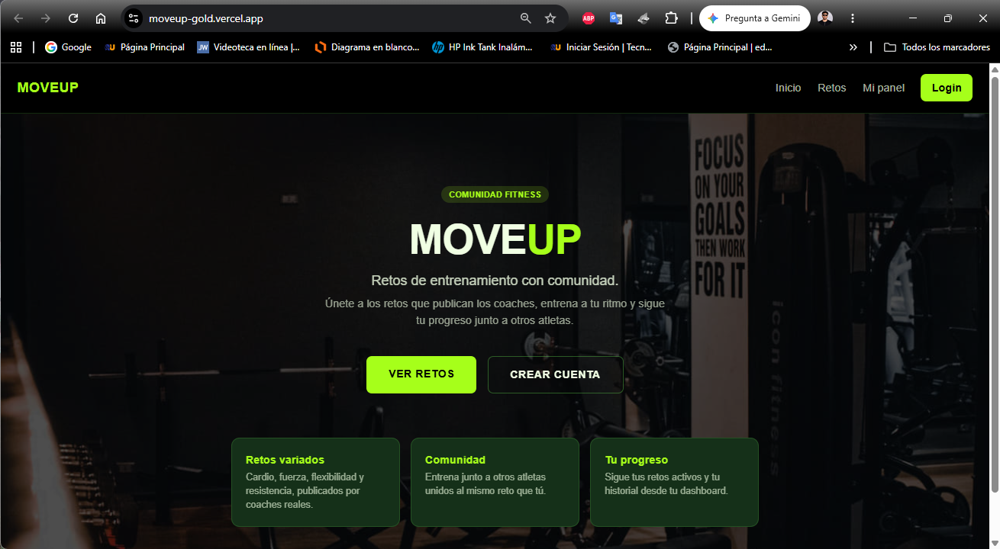
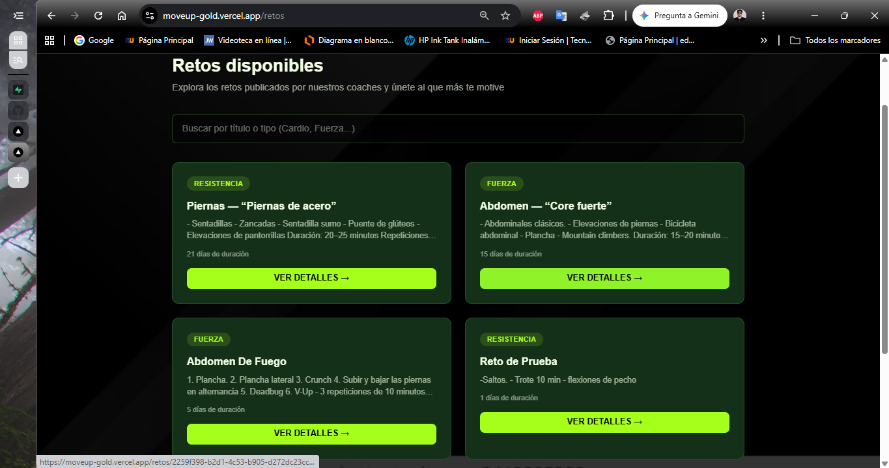
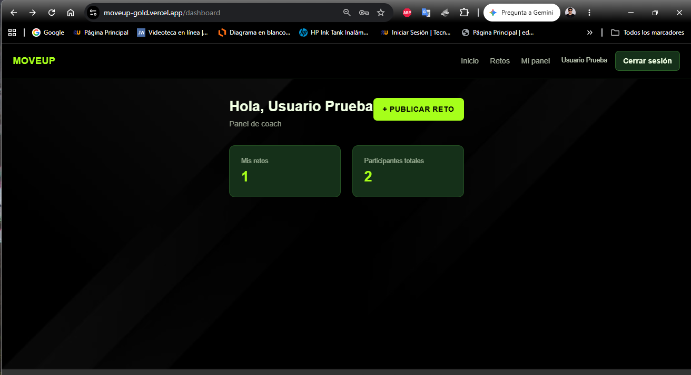

# MoveUp

Aplicación web de retos de entrenamiento con comunidad. Un `coach` publica retos de ejercicio y un `atleta` se une a los retos que le interesan, sigue su progreso y entrena junto a otros usuarios.

Proyecto Integrador — Aplicaciones Web.

**Demo en producción:** https://moveup-gold.vercel.app
**Repositorio:** https://github.com/Axcell96/moveup

## Capturas de pantalla

| Inicio | Listado de retos | Dashboard (coach) |
|---|---|---|
|  |  |  |

## Roles

- **atleta** — se une a retos, ve sus retos activos en su dashboard.
- **coach** — publica retos, ve sus retos publicados, edita, elimina y consulta los participantes de cada uno.

El rol se guarda en la base de datos (tabla `profiles`), no está hardcodeado en el frontend.

## Funcionalidades (checklist de requisitos)

- [x] Mínimo 2 roles de usuario (`atleta`, `coach`), guardados en base de datos.
- [x] 2+ rutas públicas (`/`, `/retos`, `/retos/[id]`).
- [x] 2+ rutas privadas (`/dashboard`, `/dashboard/mis-retos`, `/dashboard/nueva-reto`).
- [x] 1+ ruta dinámica (`/retos/[id]`).
- [x] Autenticación real con Supabase Auth (registro, login, logout, protección de rutas privadas con middleware).
- [x] 3+ tablas relacionadas con llaves foráneas (`profiles`, `retos`, `participaciones`).
- [x] Tabla que extiende `auth.users` (`profiles`, relación 1:1).
- [x] Relación uno-a-muchos (`coach` → `retos`) y muchos-a-muchos (`atletas` ↔ `retos` vía `participaciones`).
- [x] Row Level Security (RLS) activado en las tres tablas principales.
- [x] CRUD completo de retos: crear, listar, ver detalle, editar y eliminar (solo el coach dueño del reto puede editarlo o eliminarlo; validado en el servidor).
- [x] Los atletas pueden unirse a un reto y ver los retos a los que ya están unidos.
- [x] Los coaches pueden ver la lista de atletas participantes en cada uno de sus retos.
- [x] Componente interactivo con `useState`: búsqueda de retos por texto en `/retos`.
- [x] Consumo de API externa con `fetch` + `async/await` y manejo de errores: sugerencia de ejercicios desde [wger.de](https://wger.de/api/v2/) según el tipo de reto.
- [x] Despliegue en Vercel.
- [x] README completo.

## Rutas

| Ruta | Tipo | Descripción |
|---|---|---|
| `/` | Pública | Página de inicio |
| `/retos` | Pública | Listado de retos publicados, con buscador |
| `/retos/[id]` | Pública/dinámica | Detalle de un reto + ejercicios sugeridos (wger.de) |
| `/login`, `/register` | Pública | Autenticación |
| `/dashboard` | Privada | Panel según rol (coach o atleta) |
| `/dashboard/nueva-reto` | Privada (coach) | Publicar un nuevo reto |
| `/dashboard/mis-retos` | Privada | Coach: gestionar sus retos. Atleta: ver retos activos |
| `/dashboard/mis-retos/[id]/editar` | Privada (coach) | Editar un reto propio |

## Modelo de datos (Supabase / PostgreSQL)

```
auth.users (Supabase Auth)
    │
    ├─▶ profiles          (id = auth.users.id, full_name, role, bio)
    │
    ├─▶ retos             (coach_id → auth.users.id, titulo, descripcion, tipo, duracion_dias)
    │       │
    │       └─▶ participaciones  (reto_id → retos.id, atleta_id → auth.users.id)
```

- Un coach tiene muchos retos (relación uno-a-muchos).
- Un reto tiene muchos participantes a través de la tabla intermedia `participaciones` (relación muchos-a-muchos entre atletas y retos).
- `participaciones.reto_id` tiene `ON DELETE CASCADE`: al eliminar un reto se eliminan automáticamente sus participaciones.

## Stack técnico

<!-- TODO: confirma la versión exacta de cada paquete abriendo tu package.json (o corriendo `npm list next react tailwindcss` en la raíz del proyecto) y reemplaza los números de abajo si no coinciden. Puse Next.js 15 como valor tentativo. -->

- **Frontend / Backend:** Next.js 15 (App Router), React, TypeScript
- **Estilos:** Tailwind CSS
- **Base de datos y autenticación:** Supabase (PostgreSQL + Auth + RLS)
- **API externa:** [wger.de API v2](https://wger.de/es/exercise/overview/) — catálogo de ejercicios
- **Despliegue:** Vercel

## Correr el proyecto localmente

1. Clonar el repositorio:

   ```bash
   git clone https://github.com/Axcell96/moveup.git
   cd moveup
   ```

2. Instalar dependencias:

   ```bash
   npm install
   ```

3. Crear un archivo `.env.local` en la raíz del proyecto con las siguientes variables (obtenerlas desde el panel de tu proyecto en Supabase → Project Settings → API):

   ```
   NEXT_PUBLIC_SUPABASE_URL=
   NEXT_PUBLIC_SUPABASE_PUBLISHABLE_KEY=
   ```

4. Ejecutar el servidor de desarrollo:

   ```bash
   npm run dev
   ```

5. Abrir [http://localhost:3000](http://localhost:3000).

## Credenciales de prueba

Cuentas dedicadas para que el docente pueda entrar sin registrarse:

| Rol | Correo | Contraseña |
|---|---|---|
| Coach | `apad@test.com` | `Admin123` |
| Atleta | `jpaz@test.com` | `Admin123` |

## Autor

**Axcell Padilla**
GitHub: [@Axcell96](https://github.com/Axcell96)


## Notas

- La API de wger.de es una fuente de datos externa e independiente de Supabase (Supabase almacena usuarios, retos y participaciones; wger.de solo aporta el catálogo de ejercicios sugeridos).
- El archivo `.env.local` no se sube al repositorio (está en `.gitignore`); en producción, las variables de entorno se configuran directamente en Vercel.

## Video de defensa

[Ver video de defensa (Exm_2P_APadilla.mp4)](https://ister-my.sharepoint.com/:v:/g/personal/axcell_padilla_ister_edu_ec/IQDmPPvsNRc1Sb5C1JttZxX2AXWdBTj0WBUba4rtUvq8rQQ?nav=eyJyZWZlcnJhbEluZm8iOnsicmVmZXJyYWxBcHAiOiJPbmVEcml2ZUZvckJ1c2luZXNzIiwicmVmZXJyYWxBcHBQbGF0Zm9ybSI6IldlYiIsInJlZmVycmFsTW9kZSI6InZpZXciLCJyZWZlcnJhbFZpZXciOiJNeUZpbGVzTGlua0NvcHkifX0&e=FIXl4H)

## Codigo VSCode
https://ister-my.sharepoint.com/:u:/g/personal/axcell_padilla_ister_edu_ec/IQC6xaFAWUgrTawLNrLzittKAT_OLsDpiopJImsgw3ccd-M?e=lxHHVn

## Vercel
https://moveup-gold.vercel.app/
